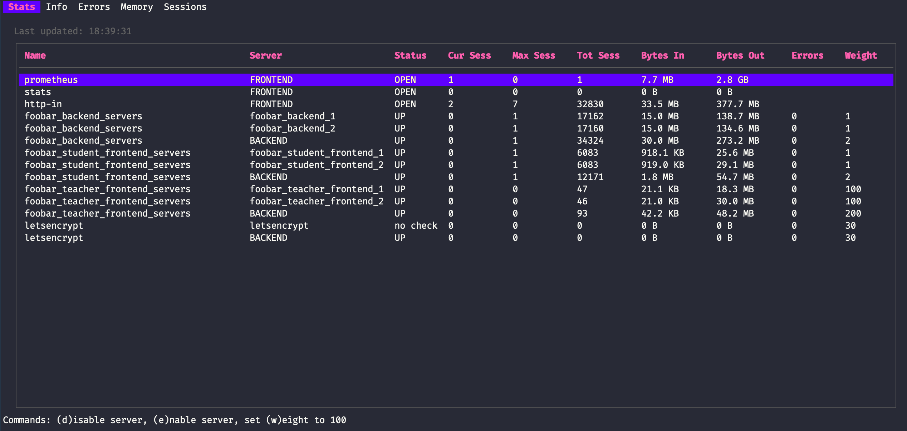

# LazyHAP

## Overview

LazyHAP is a lightweight, portable HAProxy TUI tool written in Go.



## Features

- Real-time HAProxy server statistics
- Multiple tab views:
  - Stats
  - Info
  - Errors
  - Memory
  - Sessions
  - Certs
  - Threads

## Status

🚧 Early Prototype 🚧

- Experimental implementation
- Subject to significant changes

## Build

```bash
go build
```

## Usage

Use default HAProxy socket path (`/var/run/haproxy/admin.sock`)

```bash
./lazyhap
```

Specify custom socket path

```bash
./lazyhap /path/to/custom/haproxy/admin.sock
```

## Controls

- `tab`/`shift+tab` or `left`/`right`: Navigate tabs
- `d`: Disable server
- `e`: Enable server
- `w`: Set server weight to 100
- `q`: Quit

## Requirements

- HAProxy
- Unix-like system with socket access

## Disclaimer

This is an early-stage project and should not be actually used
anywhere near a production server.

## License

[MIT License](LICENSE)

## Contributions

Contributions and feedback welcome.
