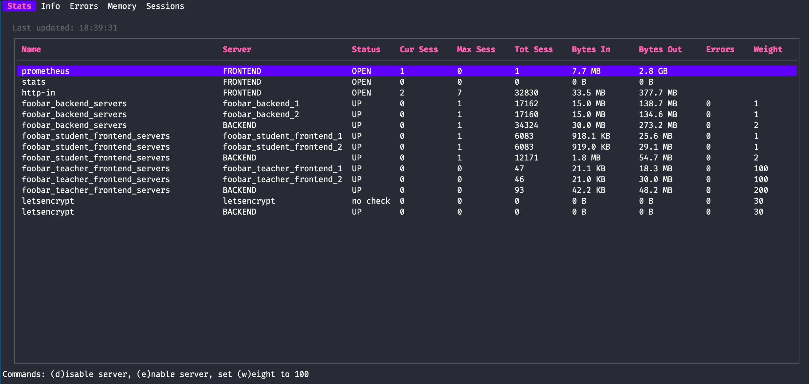

# LazyHAP

A terminal UI for monitoring and managing HAProxy servers via Unix socket.



## Features

- 9 tabbed views: Stats, Info, Errors, Memory, Sessions, Certs, Threads, Activity, Events
- Color-coded server status (UP/DOWN/MAINT/DRAIN/NOLB) and error counts
- Server control: disable, drain, enable, ready, kill sessions, set weight, clear counters
- Column sorting in Stats tab
- Filtering/search across all tabs
- Vim-style navigation with number key tab jumping (1-9)
- Connection status indicator
- Clipboard copy support
- Config file for persistent settings

## Install

```bash
go build -o lazyhap ./src/
```

## Usage

```bash
# Default socket path (/var/run/haproxy/admin.sock)
./lazyhap

# Custom socket path
./lazyhap /path/to/haproxy/admin.sock
```

### Configuration

Optional config at `~/.config/lazyhap/config.json`:

```json
{
  "socket_path": "/var/run/haproxy/admin.sock",
  "refresh_interval_ms": 5000
}
```

Command-line arguments take precedence.

### Remote socket via SSH

```bash
ssh -L ./admin.sock:/var/run/haproxy/admin.sock user@remote-host
./lazyhap ./admin.sock
```

## Controls

| Key | Action |
|-----|--------|
| `tab`/`shift+tab`, `h`/`l` | Switch tabs |
| `1-9` | Jump to tab |
| `j`/`k` | Navigate rows |
| `g`/`G` | Go to top/bottom |
| `/` | Filter/search |
| `r` | Refresh current tab |
| `y` | Copy to clipboard |
| `s` | Cycle sort column (Stats) |
| `?` | Help |
| `q` | Quit |

### Stats tab

| Key | Action |
|-----|--------|
| `d` | Disable server |
| `D` | Drain server |
| `e` | Enable server |
| `R` | Set server ready |
| `w` | Set weight (input popup) |
| `x` | Kill sessions (confirm) |
| `c` | Clear counters |

## Requirements

- HAProxy with Unix socket access
- Go 1.21+

## License

[MIT License](LICENSE)
